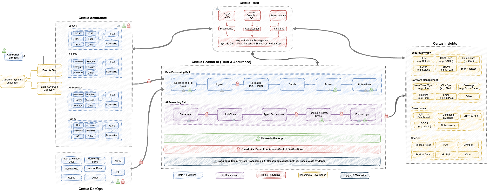

# Architecture

???+ info "Click to view Architecture"

    { .static-diagram }

---

### Reading the Diagram
The illustration groups the assurance platform into four color-coded lanes:

- **Yellow** – inputs and downstream consumers (manifests, external programs, ticketing, reporting).
- **Blue** – the assurance platform core that ingests evidence, normalizes findings, enriches context, manages assets, and enforces policies.
- **Purple** – AI reasoning capabilities (retrievers, fusion logic, schema/safety gates, agent orchestrators, LLM chains).
- **Red** – the TrustCentre services (sign/verify, provenance, transparency, ledgers, timestamps, key management) plus platform guardrails, verification, and observability.

The remainder of this doc walks left-to-right across the diagram.

---

### 1. Assurance Inputs
**Assurance Manifest** acts as the declarative contract for a run. It scopes systems, models, datasets, policies, thresholds, and metadata (owners, environments, risk tier) and is signed before distribution. Pipeline orchestrators (Dagger, GitHub Actions, Tekton, GitLab CI, etc.) use the manifest to plan execution, fan out jobs, and stream signed status back to the TrustCentre.

**Systems Under Test** include application repos, container images, infrastructure definitions, AI models (`.onnx`, `.pt`, `.safetensors`), datasets/ETL jobs, and runtime workloads. The manifest maps each target to required scanners and policy gates so the pipeline can trace accountability per asset.

---

### 2. Testing & Evidence Fabric
Left-hand stacks in the diagram show how heterogeneous tooling feeds the platform. Each row runs its own plan → stage → parse/normalize cycle before forwarding structured artifacts.

| Lane | Example Tooling | Primary Evidence |
|------|-----------------|------------------|
| **Security** | SAST, DAST, SCA, IaC, Fuzzing | Vulnerabilities, misconfigurations, library drift |
| **Integrity** | Sigstore, SLSA attestations, Falco, provenance checkers | Supply-chain trust, workload drift, runtime tampering |
| **Safety & Privacy** | Presidio, Macie, Great Expectations, policy-as-code checks | PII leakage, policy posture, privacy regressions |
| **AI & Other Specialized** | PyRIT, Guardrails, DeepEval, model-level unit tests, domain-specific scanners | Bias, hallucination and jailbreak scores, data/feature anomalies |

Each scanner emits SARIF, JSON, or Protobuf that is signed (or signable) and tagged with run metadata so downstream stages can deduplicate and correlate findings across reruns.

---

### 3. Assurance Platform Core (Blue Lane)
Once evidence lands in the platform, the blue lane takes over:

1. **Ingest** – Validates signatures, enforces manifest scope, and writes raw evidence blobs plus metadata envelopes to staging object storage.
2. **Normalize & Dedupe** – Converts every scanner schema to a unified finding model (SARIF-first), fingerprints issues, collapses duplicates, and maintains run-to-run lineage.
3. **Enrich** – Adds contextual (owners, service, environment, SLA tier) and threat intel (CVSS/CWE, KEV/EPSS, exploit status, patchability) data. Evidence URIs remain placeholders until TrustCentre signing completes.
4. **Assets** – Maintains the catalog of systems, models, datasets, policies, and waivers linked to each finding. This enables cross-run impact analysis and asset-specific gates.
5. **Policy Gate** – Evaluates normalized, enriched findings against policy-as-code (CUE, Rego/OPA). Output is a deterministic decision record referencing manifest version, policy bundle digest, and evidence URIs.

These blocks map directly to the sequenced rectangles across the main blue swimlane.

---

### 4. AI Reasoning Fabric (Purple Lane)
Sitting directly beneath the core pipeline, the purple lane provides higher-order reasoning and automation:

- **Retrievers** query vector stores, OCI manifests, or ticket systems to collect prior context.
- **LLM Chain** executes curated prompt/response flows for summarization, explanation, or narrative generation.
- **Agent Orchestrator** coordinates specialist agents (risk summarizer, waiver validator, privacy reviewer) so tasks can branch/merge while staying policy-aware.
- **Schema & Safety Gates** enforce structured outputs, reject hallucinations, and ensure AI-generated artifacts satisfy bias and safety thresholds before distribution.
- **Fusion Logic** correlates signals (e.g., vulnerability + EPSS + waiver status) to synthesize insights for dashboards or chat interfaces.

Outputs feed back into enrichment, policy gates, and downstream communications, always referencing verifiable evidence IDs.

---

### 5. Human-in-the-Loop (Green Bar)
When policy gates detect exceptions (critical vulns, high EPSS, privacy exceedances, AI safety anomalies), the pipeline pauses at the human-in-the-loop (HITL) layer. Reviewers receive a signed package (findings + context + AI summary), approve or reject within SLA, and their decision is recorded as a signed artifact and reintroduced to the gate for re-evaluation.

---

### 6. Guardrails & Verification (Red Bar)
Beneath HITL, platform guardrails perform biological-safety-style controls for AI components (prompt isolation, output filtering, escape prevention) and enforce deterministic verification on every automated action. This ensures LLM or agent-driven steps cannot mutate evidence, bypass policy, or leak confidential data. All guardrail verdicts become part of the audit log.

---

### 7. Logging & Observability (Gray Bar)
Every service emits structured logs, metrics, traces, and event streams. Real-time observability allows:

- Pipeline health and latency tracking
- Drift/change detection on policies and manifests
- Evidence lifecycle monitoring (created → signed → consumed)
- Continuous export to SIEM/SOAR or BI platforms shown on the far right of the diagram

---

### 8. TrustCentre (Red Box)
The TrustCentre underpins the entire flow and bi-directionally links to ingest, gates, HITL, and downstream systems.

| Capability | Description |
|------------|-------------|
| **Sign / Verify** | Cosign, Sigstore, or enterprise KMS-backed signing for manifests, scanner outputs, policy results, waivers, and AI artifacts. |
| **WORM OCI Registry** | Write-once stores (Harbor, ORAS, Artifact Registry) for immutable evidence digests. |
| **Transparency** | Rekor/Merkle logs for public/internal verifiability of evidence chains. |
| **Provenance** | SBOM/SLSA lineage linking “who/what/when/how” for every artifact. |
| **Audit Ledger** | Append-only ledger of pipeline operations, approvals, and guardrail triggers. |
| **Timestamp** | RFC 3161 or equivalent trusted-time anchoring of signatures. |
| **Key & Identity Management** | Policy-scoped keys using enterprise KMS, OIDC identities, delegated signing authorities, and threshold signing for critical actions. |

Signed evidence metadata (policy, owners, context, version, policy keys) travels with every artifact, enabling downstream verification without rerunning the pipeline.

---

### 9. Downstream Consumers (Yellow Boxes on Right)
Policy outcomes and signed evidence synchronize automatically to the systems highlighted on the right side of the diagram:

- **Program Systems** – SIEM (Splunk), SOAR (Swimlane), compliance registries/OSCAL hubs, raw feed storage for BI/analytics.
- **Software Management** – Issue/ticket systems (Jira), change/incident platforms (ServiceNow, Opsgenie), chat (Slack, Teams), product/engineering roadmaps, release notes, PLAs.
- **Governance** – GRC dashboards, continuous assurance portals, SBOM exchanges, MITRE/SLA tracking, audit portals.
- **Communications** – Executive dashboards, customer Trust/Assurance reports, chatbot experiences, API relays, email digests.

Each integration references immutable OCI evidence URIs so consumers can independently verify claims.

---

### 10. Evidence & Traceability Principles
Regardless of lane, the platform enforces the following:

- Every stage outputs signed or attestable artifacts (raw scanner reports, normalized SARIF, enrichment JSON, policy decisions, HITL approvals, AI reasoning traces).
- Evidence URIs and fingerprints persist into tickets, dashboards, and reports to guarantee end-to-end traceability.
- Policy-as-code, immutable storage, and human oversight combine to deliver continuous compliance, measurable trust, and real-time visibility across security, integrity, privacy, and AI assurance dimensions.
